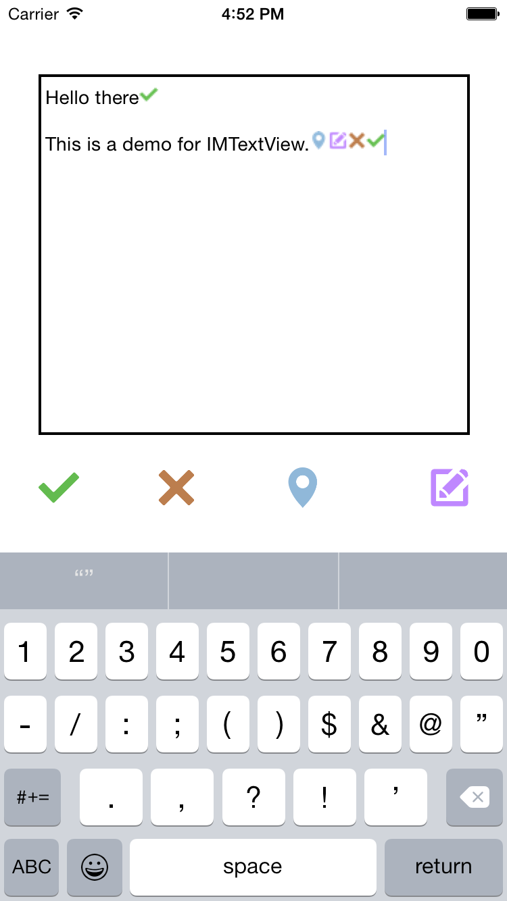
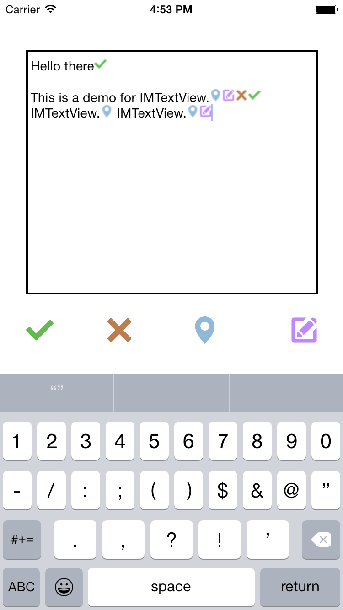
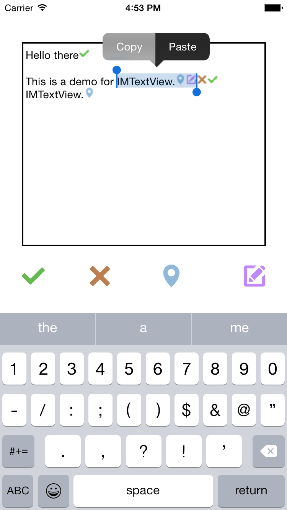
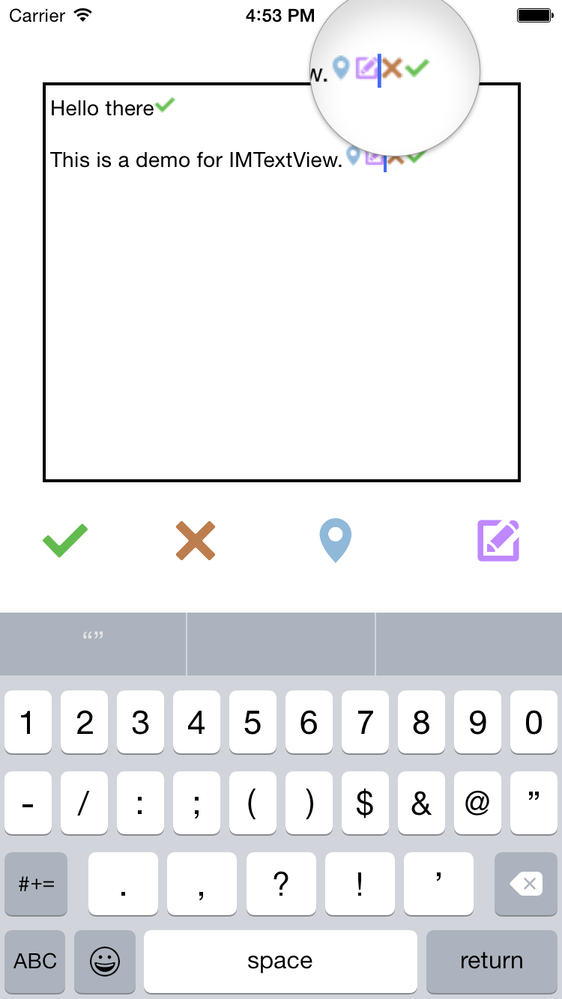

# IMTextView
An iOS textview with customized icons.

<table border="0"><tr><td></td><td></td></tr><tr><td></td><td></td></tr></table>

# Requirement
iOS 7.0+

# Installation

From <b>CocoaPods</b> :
pod 'IMTextView'

Without <b>CocoaPods</b> :
Add IMTextView.h,IMTextView.m, IMTextAttachment.h,IMTextAttachment.m files to your project.

# Usage

Instead of UITextView, you should use IMTextView. 
For ICON attachment action you should call the below method,

- (void)insertICON:(NSString *)imageName;

The default delimiting characters are  "[" for left and "]" for right. If customization needed, the default 
'PATTERN_STR' should also be changed.

# License
IMTextView is available under the MIT License.
